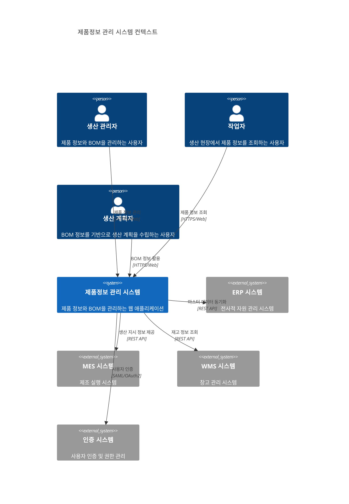
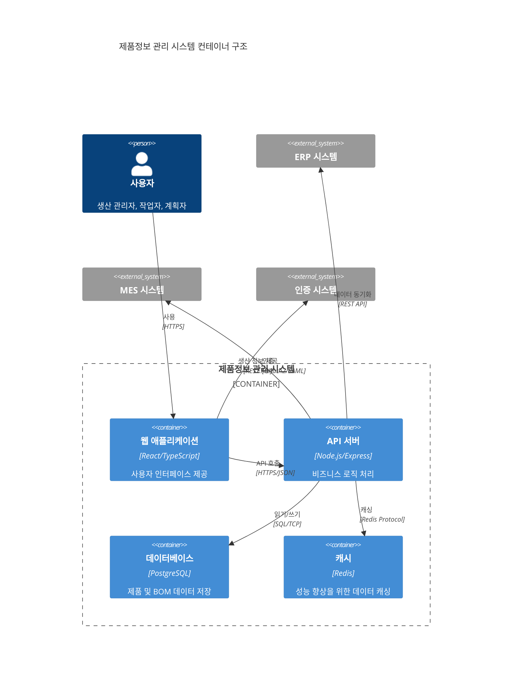
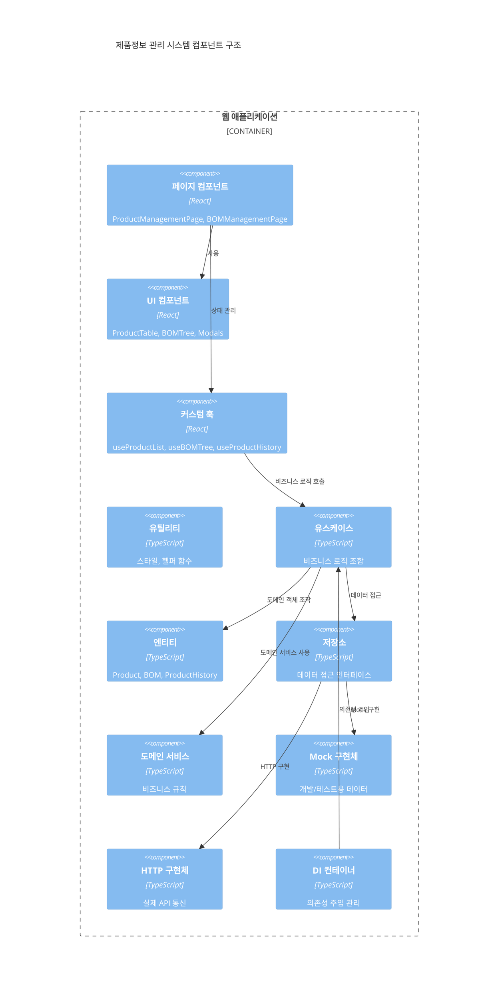
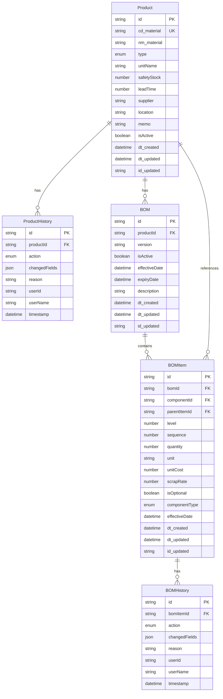
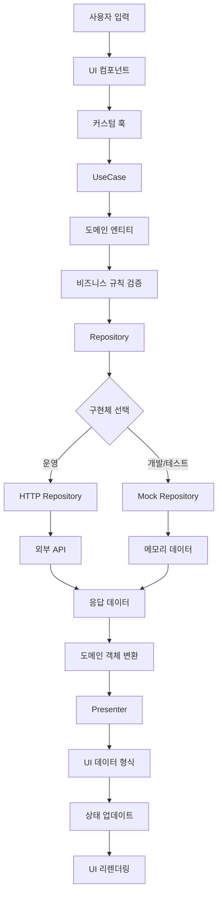
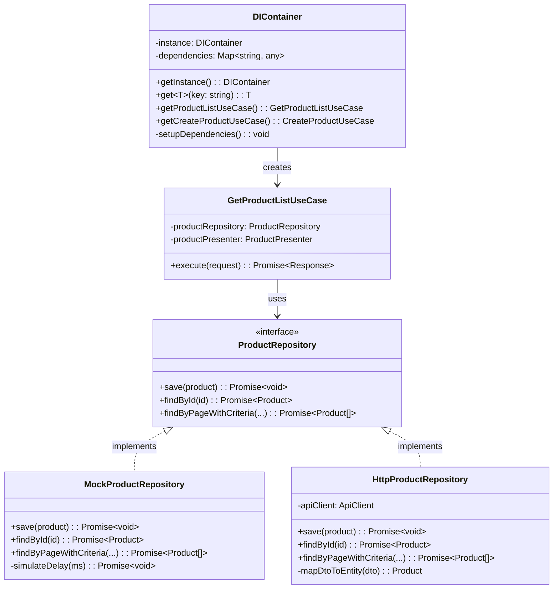

# 제조업 MES 제품정보 관리 시스템 아키텍처 문서

## 📋 목차

1. [시스템 개요](#시스템-개요)
2. [아키텍처 원칙](#아키텍처-원칙)
3. [시스템 컨텍스트](#시스템-컨텍스트)
4. [클린 아키텍처](#클린-아키텍처)
5. [컴포넌트 아키텍처](#컴포넌트-아키텍처)
6. [데이터 아키텍처](#데이터-아키텍처)
7. [UI/UX 아키텍처](#uiux-아키텍처)
8. [의존성 주입](#의존성-주입)
9. [성능 및 확장성](#성능-및-확장성)
10. [보안 아키텍처](#보안-아키텍처)
11. [아키텍처 의사결정 기록](#아키텍처-의사결정-기록)

---

## 🎯 시스템 개요

### 비즈니스 목적
제조업 현장의 제품정보와 BOM(Bill of Materials) 관리를 디지털화하여 생산 효율성을 향상시키고, 정확한 원가 계산 및 재고 관리를 지원하는 MES(Manufacturing Execution System) 모듈입니다.

### 핵심 기능
- **제품 정보 관리**: CRUD 작업, 이력 추적, 검색 및 필터링
- **BOM 관리**: 계층형 구조, 실시간 편집, 비용 계산, 비교 분석
- **변경 이력 추적**: 모든 데이터 변경사항의 상세 기록 및 추적
- **사용자 인터페이스**: 직관적이고 반응형인 웹 기반 UI

### 기술 스택

#### Frontend
- **Framework**: React 18 with TypeScript
- **State Management**: Custom Hooks + React Context
- **Styling**: Styled Components
- **Build Tool**: Create React App (CRA)
- **Package Manager**: npm

#### Backend 준비
- **Mock Layer**: 개발 및 테스트용 메모리 기반 데이터
- **API Ready**: HTTP 클라이언트 및 Repository 패턴 구현
- **Future Integration**: RESTful API / GraphQL 지원 준비

---

## 🏛️ 아키텍처 원칙

### SOLID 원칙 준수
1. **Single Responsibility**: 각 클래스와 모듈이 단일 책임을 가짐
2. **Open-Closed**: 확장에는 열려있고 수정에는 닫혀있음
3. **Liskov Substitution**: 서브타입은 기반타입으로 대체 가능
4. **Interface Segregation**: 클라이언트별 특화된 인터페이스 제공
5. **Dependency Inversion**: 고수준 모듈이 저수준 모듈에 의존하지 않음

### Clean Architecture 원칙
- **의존성 방향**: 외부 계층이 내부 계층을 의존 (단방향)
- **비즈니스 로직 보호**: 도메인 계층의 독립성 보장
- **테스트 용이성**: Mock과 실제 구현체의 완전한 분리
- **기술 독립성**: 프레임워크와 데이터베이스에 대한 독립성

### DDD (Domain-Driven Design) 적용
- **도메인 모델**: 비즈니스 규칙을 캡슐화한 엔티티
- **유비쿼터스 언어**: 도메인 전문가와 개발자 간 공통 언어
- **바운디드 컨텍스트**: 제품 관리와 BOM 관리의 명확한 경계

---

## 🌐 시스템 컨텍스트

### C4 레벨 1: 시스템 컨텍스트 다이어그램



### 시스템 경계
- **내부**: 제품 정보 관리, BOM 관리, 이력 추적
- **외부 인터페이스**: ERP, MES, WMS 시스템과의 API 연동
- **사용자 인터페이스**: 웹 브라우저 기반 반응형 UI

### 주요 이해관계자
- **생산 관리자**: 제품 정보와 BOM 마스터 데이터 관리
- **작업자**: 생산 현장에서 제품 정보 조회 및 활용
- **생산 계획자**: BOM 기반 생산 계획 수립 및 원가 분석
- **IT 관리자**: 시스템 운영 및 유지보수

---

## 🏗️ 클린 아키텍처

### C4 레벨 2: 컨테이너 다이어그램



### 아키텍처 계층 구조

```
┌─────────────────────────────────────────────┐
│             Presentation Layer              │  ← UI Components, Hooks, Pages
├─────────────────────────────────────────────┤
│             Application Layer               │  ← Use Cases, Business Logic
├─────────────────────────────────────────────┤
│               Domain Layer                  │  ← Entities, Domain Services
├─────────────────────────────────────────────┤
│           Infrastructure Layer              │  ← Repositories, APIs, Data
└─────────────────────────────────────────────┘
```

### 계층별 책임

#### 1. Domain Layer (도메인 계층)
```typescript
// 비즈니스 엔티티
export class Product {
  constructor(private readonly id: ProductId, ...) {
    this.validateProduct(); // 비즈니스 규칙 검증
  }
  
  public canBeProduced(): boolean // 도메인 로직
  public isBelowSafetyStock(currentStock: number): boolean
}

// 도메인 서비스
export interface ProductRepository {
  save(product: Product): Promise<void>;
  findById(id: ProductId): Promise<Product>;
}
```

#### 2. Application Layer (애플리케이션 계층)
```typescript
// 유스케이스
export class GetProductListUseCase {
  constructor(
    private productRepository: ProductRepository,
    private productPresenter: ProductPresenter
  ) {}
  
  async execute(request: GetProductListRequest): Promise<GetProductListResponse> {
    // 비즈니스 로직 조합
  }
}
```

#### 3. Infrastructure Layer (인프라 계층)
```typescript
// 구현체
export class MockProductRepository implements ProductRepository {
  async save(product: Product): Promise<void> {
    // Mock 데이터 저장
  }
}

export class HttpProductRepository implements ProductRepository {
  async save(product: Product): Promise<void> {
    // HTTP API 호출
  }
}
```

#### 4. Presentation Layer (프레젠테이션 계층)
```typescript
// React 컴포넌트
export const ProductManagementPage = () => {
  const { products, loading } = useProductList();
  
  return (
    <ProductTable 
      products={products} 
      loading={loading}
    />
  );
};
```

---

## 🔧 컴포넌트 아키텍처

### C4 레벨 3: 컴포넌트 다이어그램



### 주요 컴포넌트 구조

#### UI 컴포넌트 계층
```
ProductManagementPage
├── ProductSearchFilter        # 검색 및 필터링
├── ProductTable              # 제품 목록 테이블
│   ├── ProductRow           # 제품 행 컴포넌트
│   └── ActionButtons        # 액션 버튼들
├── Pagination               # 페이지네이션
└── ProductFormModal         # 제품 등록/수정 모달
    ├── ProductForm          # 제품 폼
    └── ValidationErrors     # 유효성 검증 오류
```

#### BOM 컴포넌트 계층
```
BOMManagementSection
├── BOMTreeControls          # BOM 트리 제어
├── BOMTreeTable             # 계층형 BOM 테이블
│   ├── BOMTreeNode         # BOM 노드 컴포넌트
│   └── BOMActions          # BOM 액션 버튼들
├── BOMItemModal             # BOM 아이템 편집 모달
├── BOMCompareModal          # BOM 비교 모달
└── BOMStatistics           # BOM 통계 정보
```

### 커스텀 훅 패턴

#### 비즈니스 로직 훅
```typescript
// 제품 목록 관리
export const useProductList = () => {
  const [state, setState] = useState<ProductListState>();
  const getProductListUseCase = DIContainer.getInstance().getProductListUseCase();
  
  const loadProducts = useCallback(async (request) => {
    const response = await getProductListUseCase.execute(request);
    setState({ products: response.products, ... });
  }, []);
  
  return { ...state, loadProducts, refresh };
};

// BOM 트리 관리
export const useBOMTree = (productId?: string) => {
  // BOM 트리 상태 관리 로직
};

// 제품 이력 관리
export const useProductHistory = () => {
  // 이력 조회 및 관리 로직
};
```

---

## 📊 데이터 아키텍처

### 도메인 모델 다이어그램



### 데이터 플로우 다이어그램



### Mock 데이터 관리 전략

#### 메모리 기반 데이터 저장소
```typescript
// MockData.ts - 중앙집중식 데이터 관리
export class MockData {
  private static products: Product[] = [];
  private static bomItems: BOMItem[] = [];
  private static histories: ProductHistory[] = [];
  
  // 초기 데이터 로드
  public static initialize(): void {
    this.initializeProducts();
    this.initializeBOMs();
    this.linkRelationships();
  }
  
  // 관계형 데이터 연결
  private static linkRelationships(): void {
    // Product-BOM-BOMItem 관계 설정
  }
}
```

#### 환경별 데이터 소스 전환
```typescript
// DIContainer에서 환경변수 기반 전환
const useMockData = process.env.REACT_APP_USE_MOCK_DATA !== 'false';

const productRepository = useMockData 
  ? new MockProductRepository()      // 개발/테스트
  : new HttpProductRepository(api);  // 운영
```

---

## 🎨 UI/UX 아키텍처

### 컴포넌트 설계 패턴

#### Atomic Design 적용
```
Atoms (원자)
├── Button                 # 기본 버튼
├── Input                  # 입력 필드
├── Select                 # 선택 드롭다운
└── StatusBadge           # 상태 배지

Molecules (분자)
├── SearchFilter          # 검색 필터 조합
├── ProductRow            # 제품 행
├── BOMTreeNode          # BOM 트리 노드
└── Pagination           # 페이지네이션

Organisms (유기체)
├── ProductTable         # 제품 테이블 전체
├── BOMTreeTable         # BOM 트리 테이블
├── ProductFormModal     # 제품 등록/수정 모달
└── ProductHistoryModal  # 제품 이력 모달

Templates (템플릿)
├── ProductListTemplate  # 제품 목록 레이아웃
└── BOMManagementTemplate # BOM 관리 레이아웃

Pages (페이지)
└── ProductManagementPage # 최종 페이지
```

#### 스타일 시스템 아키텍처
```typescript
// styled.ts - 중앙집중식 스타일 관리
export const theme = {
  colors: {
    primary: '#007bff',
    secondary: '#6c757d',
    success: '#28a745',
    danger: '#dc3545',
    warning: '#ffc107'
  },
  spacing: {
    xs: '4px',
    sm: '8px',
    md: '16px',
    lg: '24px',
    xl: '32px'
  },
  typography: {
    fontFamily: '"Noto Sans KR", sans-serif',
    fontSize: {
      sm: '12px',
      md: '14px',
      lg: '16px',
      xl: '18px'
    }
  }
};

// 재사용 가능한 스타일 컴포넌트
export const Card = styled.div`
  background: white;
  border-radius: 8px;
  box-shadow: 0 2px 4px rgba(0, 0, 0, 0.1);
  padding: ${theme.spacing.lg};
`;
```

### 반응형 디자인 전략

#### 브레이크포인트 시스템
```typescript
const breakpoints = {
  mobile: '320px',    // 모바일
  tablet: '768px',    // 태블릿
  desktop: '1024px',  // 데스크톱
  wide: '1200px'      // 와이드 스크린
};

// 반응형 컴포넌트 예시
export const ResponsiveContainer = styled.div`
  max-width: 1200px;
  margin: 0 auto;
  padding: 20px;
  
  @media (max-width: ${breakpoints.tablet}) {
    padding: 16px;
  }
  
  @media (max-width: ${breakpoints.mobile}) {
    padding: 12px;
  }
`;
```

### 접근성(A11y) 고려사항

#### 키보드 내비게이션
- Tab 순서 최적화
- Enter/Space 키 이벤트 처리
- Escape 키로 모달 닫기

#### 스크린 리더 지원
- `aria-label`, `aria-describedby` 속성
- `role` 속성을 통한 의미론적 마크업
- 동적 콘텐츠 변경 알림 (`aria-live`)

#### 시각적 접근성
- 충분한 색상 대비비 (WCAG 2.1 AA 기준)
- 색상에만 의존하지 않는 정보 전달
- 확대/축소 지원 (최대 200%)

---

## 🔗 의존성 주입

### DI Container 아키텍처



### 의존성 주입 패턴

#### 1. 생성자 주입 (Constructor Injection)
```typescript
export class GetProductListUseCase {
  constructor(
    private readonly productRepository: ProductRepository,
    private readonly productPresenter: ProductPresenter
  ) {}
  
  async execute(request: GetProductListRequest): Promise<GetProductListResponse> {
    // 주입받은 의존성 사용
    const products = await this.productRepository.findByPageWithCriteria(...);
    return this.productPresenter.present(products);
  }
}
```

#### 2. 인터페이스 분리 원칙 (Interface Segregation)
```typescript
// 세분화된 인터페이스
export interface ProductReader {
  findById(id: ProductId): Promise<Product>;
  findByPageWithCriteria(...): Promise<Product[]>;
}

export interface ProductWriter {
  save(product: Product): Promise<void>;
  delete(id: ProductId): Promise<void>;
}

// 필요한 인터페이스만 주입
export class GetProductListUseCase {
  constructor(private productReader: ProductReader) {}
}

export class CreateProductUseCase {
  constructor(
    private productReader: ProductReader,
    private productWriter: ProductWriter
  ) {}
}
```

#### 3. 환경별 구현체 전환
```typescript
export class DIContainer {
  private setupDependencies(): void {
    const useMockData = process.env.REACT_APP_USE_MOCK_DATA !== 'false';
    
    // Repository 선택
    const productRepository = useMockData 
      ? new MockProductRepository()
      : new HttpProductRepository(this.apiClient);
    
    // Domain Services
    const productCodeGenerator = new DefaultProductCodeGenerator(productRepository);
    const productUsageChecker = new DefaultProductUsageChecker();
    
    // Use Cases with Dependencies
    const createProductUseCase = new CreateProductUseCase(
      productRepository,
      productHistoryRepository,
      productCodeGenerator
    );
    
    this.dependencies.set('CreateProductUseCase', createProductUseCase);
  }
}
```

### 순환 의존성 해결 전략

#### 1. 인터페이스를 통한 의존성 역전
```typescript
// 순환 의존성 발생 상황
// Product → BOM → BOMItem → Product (순환!)

// 해결: 인터페이스 도입
export interface ProductProvider {
  getProduct(id: ProductId): Promise<Product>;
}

export class BOMItem {
  constructor(
    private componentId: ProductId,
    private productProvider: ProductProvider // 인터페이스에 의존
  ) {}
}
```

#### 2. 이벤트 기반 디커플링
```typescript
// 도메인 이벤트를 통한 느슨한 결합
export class ProductUpdatedEvent {
  constructor(
    public readonly productId: ProductId,
    public readonly changedFields: FieldChange[]
  ) {}
}

export class ProductHistoryService {
  handleProductUpdated(event: ProductUpdatedEvent): void {
    // 이력 기록 로직
  }
}
```

---

## ⚡ 성능 및 확장성

### 성능 최적화 전략

#### 1. React 성능 최적화
```typescript
// 메모이제이션을 통한 렌더링 최적화
export const ProductTable = React.memo<ProductTableProps>(({ 
  products, 
  onEdit, 
  onDelete 
}) => {
  const memoizedProducts = useMemo(() => 
    products.map(product => ({
      ...product,
      displayType: getTypeDisplayName(product.type)
    })), 
    [products]
  );
  
  const handleEdit = useCallback((product: ProductListItem) => {
    onEdit(product);
  }, [onEdit]);
  
  return (
    <Table>
      {memoizedProducts.map(product => (
        <ProductRow 
          key={product.id}
          product={product}
          onEdit={handleEdit}
        />
      ))}
    </Table>
  );
});

// 가상화를 통한 대량 데이터 처리
export const VirtualizedBOMTree = ({ nodes }: { nodes: BOMTreeNode[] }) => {
  const rowRenderer = useCallback(({ index, key, style }: ListRowProps) => (
    <div key={key} style={style}>
      <BOMTreeNode node={nodes[index]} />
    </div>
  ), [nodes]);
  
  return (
    <AutoSizer>
      {({ height, width }) => (
        <List
          height={height}
          width={width}
          rowCount={nodes.length}
          rowHeight={50}
          rowRenderer={rowRenderer}
        />
      )}
    </AutoSizer>
  );
};
```

#### 2. 데이터 로딩 최적화
```typescript
// 지연 로딩 (Lazy Loading)
export const useBOMTree = (productId?: string) => {
  const [expandedNodes, setExpandedNodes] = useState<Set<string>>(new Set());
  
  const loadNodeChildren = useCallback(async (nodeId: string) => {
    if (!expandedNodes.has(nodeId)) {
      // 필요한 시점에만 하위 노드 로드
      const children = await getBOMChildrenUseCase.execute({ nodeId });
      setExpandedNodes(prev => new Set([...prev, nodeId]));
    }
  }, [expandedNodes]);
  
  return { loadNodeChildren, expandedNodes };
};

// 캐싱을 통한 중복 요청 방지
export class CachedProductRepository implements ProductRepository {
  private cache = new Map<string, Product>();
  private cacheTimeout = 5 * 60 * 1000; // 5분
  
  async findById(id: ProductId): Promise<Product> {
    const cacheKey = id.getValue();
    const cached = this.cache.get(cacheKey);
    
    if (cached && this.isCacheValid(cacheKey)) {
      return cached;
    }
    
    const product = await this.repository.findById(id);
    this.cache.set(cacheKey, product);
    return product;
  }
}
```

#### 3. 번들 최적화
```typescript
// 코드 스플리팅
const ProductManagementPage = React.lazy(() => 
  import('./ProductManagementPage')
);
const BOMManagementPage = React.lazy(() => 
  import('./BOMManagementPage')
);

// 트리 쉐이킹을 위한 ES 모듈 사용
export { GetProductListUseCase } from './GetProductListUseCase';
export { CreateProductUseCase } from './CreateProductUseCase';
// 전체 export 대신 개별 export

// 웹팩 번들 분석을 통한 최적화
// npm run build -- --analyze
```

### 확장성 설계

#### 1. 마이크로 프론트엔드 준비
```typescript
// 모듈별 독립적 번들링 가능한 구조
export interface ProductModule {
  initialize(): void;
  getRoutes(): RouteConfig[];
  getComponent(): React.ComponentType;
}

export class ProductManagementModule implements ProductModule {
  initialize(): void {
    // 모듈별 DI 설정
  }
  
  getRoutes(): RouteConfig[] {
    return [
      { path: '/products', component: ProductManagementPage },
      { path: '/products/:id', component: ProductDetailPage }
    ];
  }
}
```

#### 2. API 버전 관리 전략
```typescript
// API 버전 관리
export interface ApiClient {
  get<T>(url: string, version?: string): Promise<T>;
  post<T>(url: string, data: any, version?: string): Promise<T>;
}

export class HttpApiClient implements ApiClient {
  async get<T>(url: string, version = 'v1'): Promise<T> {
    const response = await fetch(`/api/${version}${url}`, {
      headers: {
        'Accept': `application/vnd.api+json;version=${version}`,
        'Content-Type': 'application/json'
      }
    });
    
    return response.json();
  }
}
```

#### 3. 다국어 지원 준비
```typescript
// i18n 인터페이스 정의
export interface Translator {
  t(key: string, params?: Record<string, any>): string;
  changeLanguage(lang: string): Promise<void>;
}

export const useTranslation = (): Translator => {
  return {
    t: (key: string, params?: Record<string, any>) => {
      // 번역 로직
      return messages[currentLanguage][key] || key;
    },
    changeLanguage: async (lang: string) => {
      // 언어 변경 로직
    }
  };
};
```

---

이 아키텍처 문서는 시스템의 현재 상태를 반영하며, 향후 확장 및 개선 방향을 제시합니다. 각 섹션은 실제 코드와 일치하도록 작성되었으며, 지속적인 업데이트를 통해 최신 상태를 유지해야 합니다.