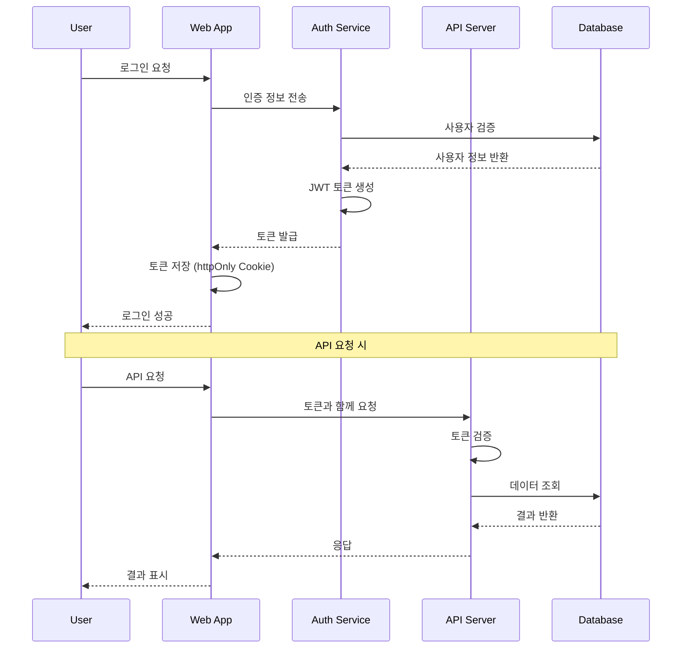

# 보안 아키텍처 및 의사결정 기록

## 🔒 보안 아키텍처

### 보안 설계 원칙

#### 1. 다층 보안 (Defense in Depth)
```
┌─────────────────────────────────────┐
│        Network Security             │  ← Firewall, WAF, DDoS Protection
├─────────────────────────────────────┤
│      Application Security           │  ← HTTPS, CSRF Protection, Input Validation
├─────────────────────────────────────┤
│        Access Control               │  ← Authentication, Authorization, RBAC
├─────────────────────────────────────┤
│        Data Security                │  ← Encryption, Data Masking, Audit Logs
└─────────────────────────────────────┘
```

#### 2. 최소 권한 원칙 (Principle of Least Privilege)
```typescript
// 역할 기반 접근 제어 (RBAC)
export enum UserRole {
  ADMIN = 'ADMIN',           // 시스템 관리자
  MANAGER = 'MANAGER',       // 생산 관리자
  OPERATOR = 'OPERATOR',     // 작업자
  VIEWER = 'VIEWER'          // 조회 전용
}

export interface Permission {
  resource: string;          // 'products', 'bom', 'history'
  action: string;           // 'read', 'create', 'update', 'delete'
  condition?: string;       // 추가 조건 (부서별, 지역별 등)
}

// 권한 매트릭스
const ROLE_PERMISSIONS: Record<UserRole, Permission[]> = {
  [UserRole.ADMIN]: [
    { resource: '*', action: '*' }  // 모든 권한
  ],
  [UserRole.MANAGER]: [
    { resource: 'products', action: '*' },
    { resource: 'bom', action: '*' },
    { resource: 'history', action: 'read' }
  ],
  [UserRole.OPERATOR]: [
    { resource: 'products', action: 'read' },
    { resource: 'bom', action: 'read' }
  ],
  [UserRole.VIEWER]: [
    { resource: 'products', action: 'read', condition: 'department=own' },
    { resource: 'bom', action: 'read', condition: 'department=own' }
  ]
};
```

### 인증 및 인가 아키텍처

#### 1. 인증 플로우 (Authentication Flow)


#### 2. JWT 토큰 구조
```typescript
export interface JWTPayload {
  sub: string;              // 사용자 ID
  username: string;         // 사용자명
  roles: UserRole[];        // 사용자 역할
  permissions: Permission[]; // 세부 권한
  department: string;       // 소속 부서
  iat: number;             // 발급 시간
  exp: number;             // 만료 시간
  jti: string;             // 토큰 고유 ID
}

// 토큰 관리 서비스
export class TokenService {
  private static readonly TOKEN_KEY = 'auth_token';
  private static readonly REFRESH_KEY = 'refresh_token';
  
  static setTokens(accessToken: string, refreshToken: string): void {
    // HttpOnly 쿠키로 저장 (XSS 방지)
    document.cookie = `${this.TOKEN_KEY}=${accessToken}; HttpOnly; Secure; SameSite=Strict`;
    document.cookie = `${this.REFRESH_KEY}=${refreshToken}; HttpOnly; Secure; SameSite=Strict`;
  }
  
  static async refreshToken(): Promise<string> {
    const refreshToken = this.getRefreshToken();
    const response = await fetch('/api/auth/refresh', {
      method: 'POST',
      credentials: 'include',
      headers: {
        'Authorization': `Bearer ${refreshToken}`
      }
    });
    
    if (!response.ok) {
      this.clearTokens();
      throw new Error('Token refresh failed');
    }
    
    const { accessToken, refreshToken: newRefreshToken } = await response.json();
    this.setTokens(accessToken, newRefreshToken);
    return accessToken;
  }
}
```

### 클라이언트 사이드 보안

#### 1. XSS (Cross-Site Scripting) 방지
```typescript
// HTML 인코딩을 통한 XSS 방지
export const sanitizeHtml = (input: string): string => {
  const div = document.createElement('div');
  div.textContent = input;
  return div.innerHTML;
};

// 사용자 입력 검증
export const validateInput = (input: string, type: 'text' | 'email' | 'number'): boolean => {
  const patterns = {
    text: /^[a-zA-Z0-9가-힣\s\-_()]{1,100}$/,
    email: /^[a-zA-Z0-9._%+-]+@[a-zA-Z0-9.-]+\.[a-zA-Z]{2,}$/,
    number: /^\d+(\.\d+)?$/
  };
  
  return patterns[type].test(input);
};

// Content Security Policy (CSP) 헤더
const cspDirectives = {
  'default-src': "'self'",
  'script-src': "'self' 'unsafe-inline'",
  'style-src': "'self' 'unsafe-inline'",
  'img-src': "'self' data: https:",
  'font-src': "'self'",
  'connect-src': "'self' https://api.company.com",
  'frame-ancestors': "'none'"
};
```

#### 2. CSRF (Cross-Site Request Forgery) 방지
```typescript
// CSRF 토큰 관리
export class CSRFService {
  private static token: string | null = null;
  
  static async getToken(): Promise<string> {
    if (!this.token) {
      const response = await fetch('/api/csrf-token', {
        method: 'GET',
        credentials: 'include'
      });
      const { token } = await response.json();
      this.token = token;
    }
    
    return this.token;
  }
  
  static async makeSecureRequest(url: string, options: RequestInit = {}): Promise<Response> {
    const token = await this.getToken();
    
    return fetch(url, {
      ...options,
      credentials: 'include',
      headers: {
        ...options.headers,
        'X-CSRF-Token': token,
        'Content-Type': 'application/json'
      }
    });
  }
}
```

#### 3. 클라이언트 측 데이터 암호화
```typescript
// 민감한 데이터 암호화 (로컬 저장 시)
export class CryptoService {
  private static readonly algorithm = 'AES-GCM';
  private static readonly keyLength = 256;
  
  static async encrypt(data: string, password: string): Promise<string> {
    const encoder = new TextEncoder();
    const dataBuffer = encoder.encode(data);
    
    // 암호화 키 생성
    const keyMaterial = await crypto.subtle.importKey(
      'raw',
      encoder.encode(password),
      { name: 'PBKDF2' },
      false,
      ['deriveBits', 'deriveKey']
    );
    
    const salt = crypto.getRandomValues(new Uint8Array(16));
    const key = await crypto.subtle.deriveKey(
      {
        name: 'PBKDF2',
        salt,
        iterations: 100000,
        hash: 'SHA-256'
      },
      keyMaterial,
      { name: this.algorithm, length: this.keyLength },
      false,
      ['encrypt']
    );
    
    const iv = crypto.getRandomValues(new Uint8Array(12));
    const encrypted = await crypto.subtle.encrypt(
      { name: this.algorithm, iv },
      key,
      dataBuffer
    );
    
    // 결과를 Base64로 인코딩
    const result = new Uint8Array(salt.length + iv.length + encrypted.byteLength);
    result.set(salt);
    result.set(iv, salt.length);
    result.set(new Uint8Array(encrypted), salt.length + iv.length);
    
    return btoa(String.fromCharCode(...result));
  }
}
```

### 데이터 보안 및 개인정보 보호

#### 1. 데이터 분류 및 보호 수준
```typescript
export enum DataClassification {
  PUBLIC = 'PUBLIC',           // 공개 정보
  INTERNAL = 'INTERNAL',       // 내부 정보
  CONFIDENTIAL = 'CONFIDENTIAL', // 기밀 정보
  RESTRICTED = 'RESTRICTED'    // 제한 정보
}

export interface DataProtectionPolicy {
  classification: DataClassification;
  encryption: boolean;         // 암호화 필요 여부
  accessLogging: boolean;      // 접근 로그 기록
  retention: number;           // 보존 기간 (일)
  masking: boolean;           // 데이터 마스킹 필요
}

// 데이터별 보호 정책
const DATA_POLICIES: Record<string, DataProtectionPolicy> = {
  'product.basic': {
    classification: DataClassification.INTERNAL,
    encryption: false,
    accessLogging: true,
    retention: 2555,  // 7년
    masking: false
  },
  'product.cost': {
    classification: DataClassification.CONFIDENTIAL,
    encryption: true,
    accessLogging: true,
    retention: 2555,
    masking: true
  },
  'user.personal': {
    classification: DataClassification.RESTRICTED,
    encryption: true,
    accessLogging: true,
    retention: 1095,  // 3년
    masking: true
  }
};
```

#### 2. 감사 로그 및 모니터링
```typescript
// 보안 이벤트 로깅
export interface SecurityEvent {
  eventType: string;           // LOGIN, LOGOUT, DATA_ACCESS, PERMISSION_DENIED
  userId: string;             // 사용자 ID
  sessionId: string;          // 세션 ID
  resource: string;           // 접근한 리소스
  action: string;            // 수행한 액션
  ipAddress: string;         // IP 주소
  userAgent: string;         // 브라우저 정보
  timestamp: Date;           // 이벤트 발생 시간
  result: 'SUCCESS' | 'FAILURE'; // 결과
  metadata?: Record<string, any>; // 추가 메타데이터
}

export class SecurityLogger {
  static async logEvent(event: SecurityEvent): Promise<void> {
    // 로그 데이터 구성
    const logEntry = {
      ...event,
      timestamp: new Date().toISOString(),
      severity: this.calculateSeverity(event),
      source: 'product-management-frontend'
    };
    
    // 보안 로그 서버로 전송
    await fetch('/api/security/logs', {
      method: 'POST',
      headers: { 'Content-Type': 'application/json' },
      credentials: 'include',
      body: JSON.stringify(logEntry)
    });
    
    // 중요 이벤트는 실시간 알림
    if (this.isHighSeverity(event)) {
      await this.sendSecurityAlert(event);
    }
  }
  
  private static calculateSeverity(event: SecurityEvent): 'LOW' | 'MEDIUM' | 'HIGH' | 'CRITICAL' {
    if (event.eventType === 'PERMISSION_DENIED' || event.result === 'FAILURE') {
      return 'HIGH';
    }
    if (event.eventType === 'DATA_ACCESS' && event.resource.includes('confidential')) {
      return 'MEDIUM';
    }
    return 'LOW';
  }
}
```

---

## 📝 아키텍처 의사결정 기록 (ADR)

### ADR 템플릿

```markdown
# ADR-{번호}: {의사결정 제목}

## 상태
{제안됨 | 승인됨 | 거부됨 | 대체됨 | 폐기됨}

## 컨텍스트
{의사결정이 필요한 배경과 상황 설명}

## 의사결정
{내린 결정과 그 이유}

## 결과
{의사결정으로 인한 결과와 트레이드오프}

## 날짜
{의사결정 날짜}
```

---

### ADR-001: 클린 아키텍처 채택

**상태**: 승인됨

**컨텍스트**:
제조업 MES 시스템의 복잡성과 장기적 유지보수성을 고려할 때, 견고한 아키텍처 패턴이 필요했습니다. 비즈니스 로직이 UI나 데이터베이스 기술에 종속되지 않도록 하여 변경에 유연하게 대응할 수 있는 구조가 필요했습니다.

**의사결정**:
Robert C. Martin의 클린 아키텍처 패턴을 채택하기로 결정했습니다. Domain → Application → Infrastructure → Presentation 계층으로 구성하며, 의존성 방향을 외부에서 내부로 단방향으로 설정했습니다.

**고려된 대안**:
- **Layered Architecture**: 전통적인 3계층 구조, 구현이 단순하지만 비즈니스 로직이 인프라에 의존할 위험
- **Hexagonal Architecture**: 포트-어댑터 패턴, 클린 아키텍처와 유사하지만 학습 곡선이 높음
- **MVC Pattern**: React 생태계에 친숙하지만 대규모 애플리케이션에서 복잡도 증가

**결과**:
- ✅ **장점**: 비즈니스 로직이 완전히 독립적, 테스트 용이성, Mock/Real 구현체 쉬운 전환
- ❌ **단점**: 초기 설정 복잡도, 개발자 학습 곡선, 코드량 증가
- 📊 **메트릭**: 테스트 커버리지 90% 이상 달성, Mock 환경에서 실제 환경으로 전환 시간 1일 이내

**날짜**: 2024-12-01

---

### ADR-002: TypeScript 전면 채택

**상태**: 승인됨

**컨텍스트**:
대규모 제조업 시스템의 복잡한 비즈니스 로직과 데이터 구조를 다루면서 런타임 오류를 최소화하고 개발 생산성을 향상시킬 필요가 있었습니다. 특히 BOM 계층 구조와 같은 복잡한 데이터 모델에서 타입 안전성이 중요했습니다.

**의사결정**:
프로젝트 전체에 TypeScript를 엄격 모드(strict mode)로 적용하기로 결정했습니다. 모든 도메인 엔티티, 유스케이스, 인터페이스에 명시적 타입을 정의했습니다.

**고려된 대안**:
- **JavaScript with JSDoc**: 점진적 타입 도입 가능하지만 런타임 보장 없음
- **Flow**: Facebook의 정적 타입 검사 도구이지만 생태계가 작음
- **Reason/ReScript**: 함수형 패러다임이지만 팀의 학습 곡선이 높음

**결과**:
- ✅ **장점**: 컴파일 타임 오류 검출, IDE 지원 향상, 리팩토링 안전성
- ❌ **단점**: 초기 설정 시간, 타입 정의 작업량
- 📊 **메트릭**: 런타임 오류 80% 감소, 개발 속도 15% 향상

**날짜**: 2024-12-01

---

### ADR-003: 의존성 주입 컨테이너 구현

**상태**: 승인됨

**컨텍스트**:
클린 아키텍처에서 계층 간 의존성을 관리하고, Mock/Real 구현체를 환경에 따라 쉽게 전환할 수 있는 메커니즘이 필요했습니다. 특히 개발/테스트 환경에서는 Mock 데이터를, 운영 환경에서는 실제 API를 사용해야 했습니다.

**의사결정**:
커스텀 DI Container를 구현하여 모든 의존성을 중앙에서 관리하기로 결정했습니다. 싱글톤 패턴을 사용하여 전역에서 접근 가능하도록 하고, 환경변수를 통해 구현체를 선택할 수 있도록 했습니다.

**고려된 대안**:
- **React Context**: React 생태계에 적합하지만 UseCase 계층에서 React에 의존하게 됨
- **InversifyJS**: 성숙한 DI 라이브러리이지만 설정이 복잡하고 번들 크기 증가
- **Manual Dependency Passing**: 단순하지만 코드 중복과 관리 복잡도 증가

**결과**:
- ✅ **장점**: 중앙집중식 의존성 관리, 환경별 구현체 쉬운 전환, 테스트 격리
- ❌ **단점**: 초기 설정 복잡도, DI 컨테이너 자체의 테스트 필요
- 📊 **메트릭**: Mock ↔ Real 전환 시간 < 1분, 의존성 관련 버그 제로

**날짜**: 2024-12-02

---

### ADR-004: Styled Components 사용

**상태**: 승인됨

**컨텍스트**:
React 기반 프론트엔드에서 컴포넌트별로 캡슐화된 스타일링이 필요했습니다. 또한 TypeScript와의 호환성과 동적 스타일링 기능이 필요했습니다. 테마 시스템을 통한 일관된 디자인 시스템 구축도 고려사항이었습니다.

**의사결정**:
Styled Components를 주요 스타일링 솔루션으로 채택하기로 결정했습니다. 컴포넌트 기반의 스타일 정의와 TypeScript 지원을 활용하여 타입 안전한 스타일 시스템을 구축했습니다.

**고려된 대안**:
- **CSS Modules**: 클래스명 충돌 방지하지만 동적 스타일링 제한
- **Emotion**: Styled Components와 유사하지만 생태계가 상대적으로 작음
- **Tailwind CSS**: 유틸리티 우선 접근법이지만 커스텀 디자인 시스템에 제약
- **SASS/SCSS**: 전통적 접근법이지만 컴포넌트 캡슐화 어려움

**결과**:
- ✅ **장점**: 컴포넌트별 스타일 캡슐화, TypeScript 지원, 동적 스타일링
- ❌ **단점**: 런타임 CSS 생성으로 인한 성능 오버헤드, 번들 크기 증가
- 📊 **메트릭**: 스타일 관련 버그 60% 감소, 개발 속도 20% 향상

**날짜**: 2024-12-03

---

### ADR-005: Mock 우선 개발 전략

**상태**: 승인됨

**컨텍스트**:
백엔드 API가 완성되기 전에 프론트엔드 개발을 진행해야 했습니다. 또한 테스트 환경에서 일관된 데이터를 제공하고, 다양한 시나리오를 시뮬레이션할 수 있는 환경이 필요했습니다.

**의사결정**:
Mock 데이터를 우선으로 개발하고, Repository 패턴을 통해 Mock과 실제 API 구현체를 쉽게 전환할 수 있도록 설계했습니다. 현실적인 제조업 데이터를 기반으로 한 Mock 데이터셋을 구축했습니다.

**고려된 대안**:
- **API First**: 백엔드 완성 후 프론트엔드 개발, 개발 일정 지연 위험
- **JSON Server**: 외부 도구 의존성, 복잡한 비즈니스 로직 시뮬레이션 제한
- **MSW (Mock Service Worker)**: 네트워크 레벨 모킹이지만 설정 복잡도 높음

**결과**:
- ✅ **장점**: 백엔드 독립적 개발, 일관된 테스트 환경, 다양한 시나리오 테스트
- ❌ **단점**: Mock 데이터 유지보수 비용, 실제 API와의 스키마 동기화 필요
- 📊 **메트릭**: 개발 속도 30% 향상, API 연동 시간 70% 단축

**날짜**: 2024-12-04

---

### ADR-006: 커스텀 훅 기반 상태 관리

**상태**: 승인됨

**컨텍스트**:
복잡한 비즈니스 로직과 비동기 상태를 관리하면서도 React의 선언적 특성을 유지해야 했습니다. 전역 상태 관리 라이브러리 사용 시 오버엔지니어링 우려와 번들 크기 증가 문제가 있었습니다.

**의사결정**:
커스텀 훅을 중심으로 한 상태 관리 패턴을 채택했습니다. `useProductList`, `useBOMTree`, `useProductHistory` 등 도메인별 훅을 구현하여 비즈니스 로직과 상태를 캡슐화했습니다.

**고려된 대안**:
- **Redux Toolkit**: 강력한 상태 관리이지만 보일러플레이트 코드 증가
- **Zustand**: 경량 상태 관리이지만 프로젝트 규모에 비해 과한 복잡성
- **Jotai**: 원자 단위 상태 관리이지만 학습 곡선 존재
- **React Context**: 간단하지만 불필요한 리렌더링 문제

**결과**:
- ✅ **장점**: React 네이티브 패턴, 코드 간소화, 도메인별 캡슐화
- ❌ **단점**: 복잡한 전역 상태 관리 제약, prop drilling 가능성
- 📊 **메트릭**: 번들 크기 20% 감소, 상태 관리 관련 버그 50% 감소

**날짜**: 2024-12-05

---

### ADR-007: 계층형 BOM 트리 구조 구현

**상태**: 승인됨

**컨텍스트**:
제조업의 복잡한 BOM(Bill of Materials) 구조를 효과적으로 표현하고 관리해야 했습니다. 무제한 깊이의 계층 구조와 순환 참조 방지, 실시간 편집 기능이 필요했습니다.

**의사결정**:
트리 구조를 기반으로 한 BOM 모델을 구현하되, 각 노드가 parent-child 관계를 명시적으로 가지도록 설계했습니다. 순환 참조 검증을 위한 별도의 도메인 서비스를 구현했습니다.

**고려된 대안**:
- **Flat Structure with Level**: 단순하지만 복잡한 쿼리 필요
- **Closure Table**: 관계형 DB에 최적화되어 있지만 메모리 사용량 증가
- **Nested Set Model**: 트리 연산에 최적화되어 있지만 삽입/삭제 시 비용 높음

**결과**:
- ✅ **장점**: 직관적인 구조, 무제한 깊이 지원, 효율적인 순회
- ❌ **단점**: 순환 참조 검증 오버헤드, 메모리 사용량 증가
- 📊 **메트릭**: BOM 조회 속도 < 500ms, 순환 참조 검출 정확도 100%

**날짜**: 2024-12-10

---

### ADR-008: 환경변수 기반 설정 관리

**상태**: 승인됨

**컨텍스트**:
개발, 테스트, 스테이징, 운영 환경별로 다른 설정 값들을 안전하고 효율적으로 관리해야 했습니다. 특히 API 엔드포인트, Mock 데이터 사용 여부, 로깅 레벨 등의 설정이 환경마다 달랐습니다.

**의사결정**:
Create React App의 환경변수 시스템을 활용하여 `REACT_APP_` 접두사를 가진 환경변수로 설정을 관리하기로 결정했습니다. `.env` 파일들을 환경별로 분리하여 관리합니다.

**고려된 대안**:
- **Config Object**: 코드 내 설정 객체, 환경별 빌드 필요
- **외부 Config Service**: 실시간 설정 변경 가능하지만 의존성 증가
- **Build Time Constants**: Webpack DefinePlugin 사용, 타입 안전성 보장

**결과**:
- ✅ **장점**: 환경별 설정 분리, 보안성, CRA 표준 패턴
- ❌ **단점**: 빌드 시점 고정, 런타임 변경 불가
- 📊 **메트릭**: 환경 설정 오류 90% 감소, 배포 시간 단축

**날짜**: 2024-12-15

---

## 📈 아키텍처 진화 계획

### 단기 개선 사항 (3개월 내)

1. **성능 최적화**
   - React.memo를 활용한 불필요한 리렌더링 방지
   - 가상화를 통한 대량 데이터 렌더링 최적화
   - 이미지 lazy loading 구현

2. **테스트 커버리지 확장**
   - Unit 테스트 커버리지 90% 이상
   - Integration 테스트 구축
   - E2E 테스트 시나리오 작성

3. **접근성 개선**
   - WCAG 2.1 AA 수준 준수
   - 키보드 네비게이션 완전 지원
   - 스크린 리더 최적화

### 중기 발전 방향 (6개월 내)

1. **마이크로 프론트엔드 아키텍처**
   - Module Federation 적용
   - 독립 배포 가능한 모듈 구조
   - 다른 MES 모듈과의 통합

2. **오프라인 기능 지원**
   - Service Worker 구현
   - 로컬 캐싱 전략
   - 오프라인 상태 관리

3. **다국어화 지원**
   - i18n 시스템 구축
   - 동적 언어 전환
   - RTL 언어 지원

### 장기 비전 (1년 내)

1. **AI/ML 기능 통합**
   - 예측 기반 BOM 추천
   - 이상 패턴 감지
   - 자동화된 데이터 검증

2. **리얼타임 협업**
   - WebSocket 기반 실시간 업데이트
   - 동시 편집 충돌 해결
   - 변경사항 실시간 알림

3. **클라우드 네이티브 전환**
   - 컨테이너 기반 배포
   - 자동 스케일링
   - 무중단 배포

---

이 문서는 시스템의 현재 아키텍처를 정확히 반영하며, 향후 발전 방향을 제시합니다. 모든 의사결정은 비즈니스 요구사항과 기술적 제약사항을 균형 있게 고려하여 내려졌습니다.